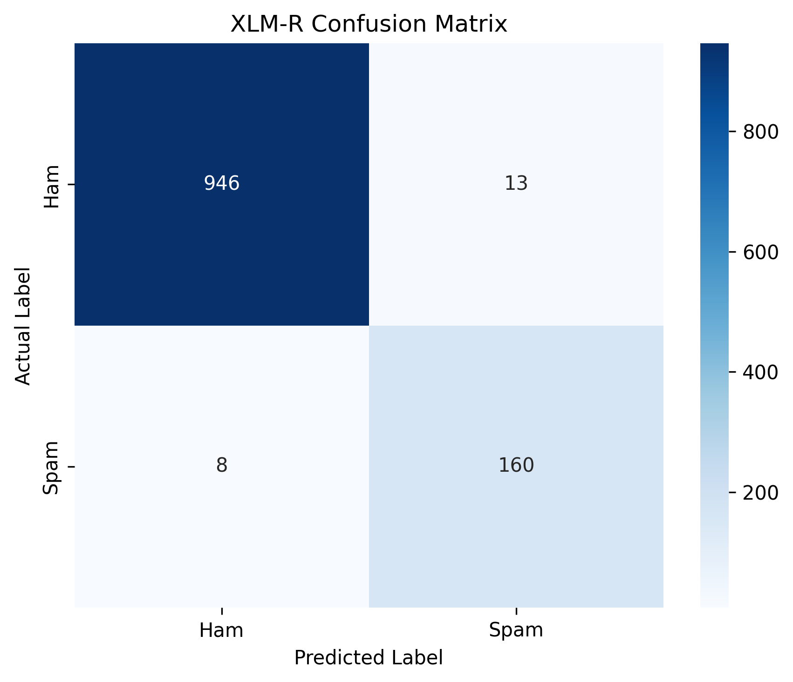
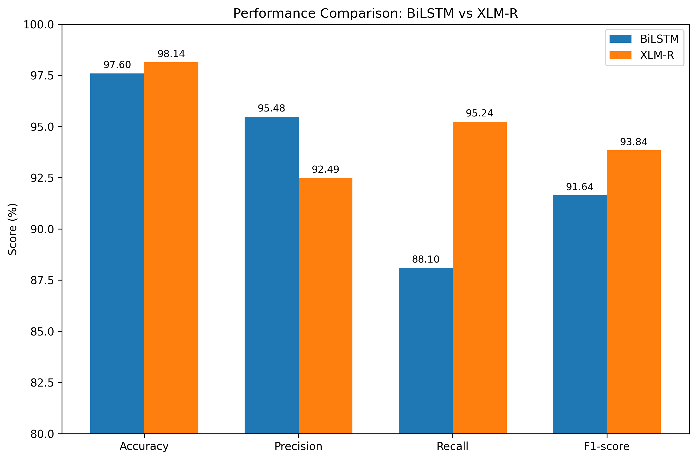
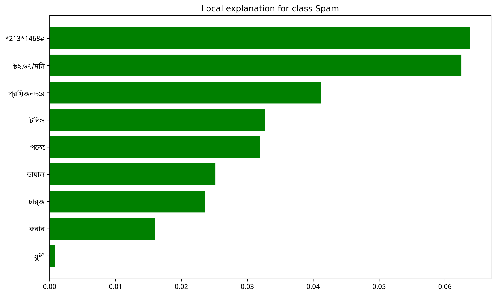
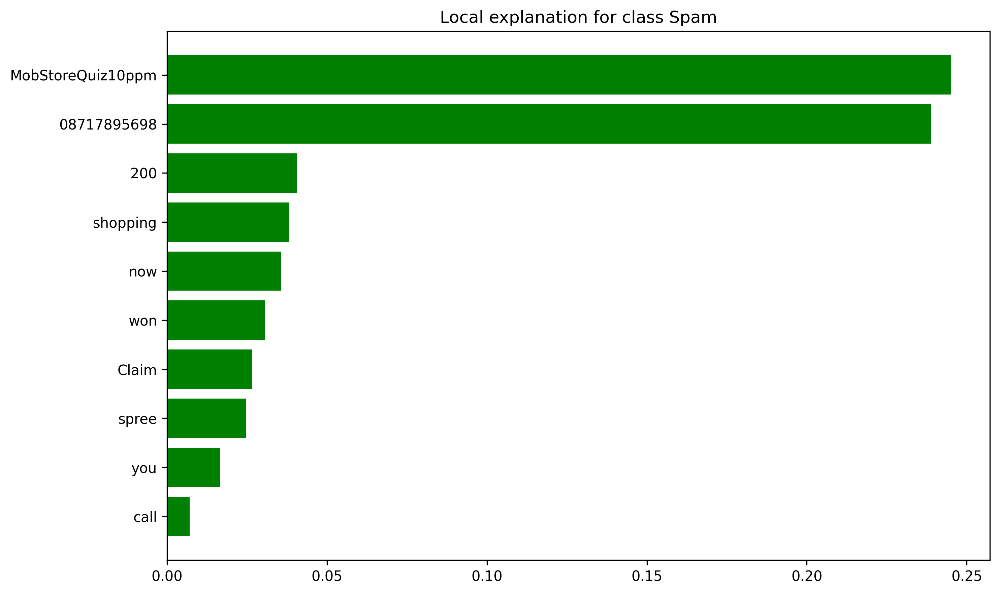
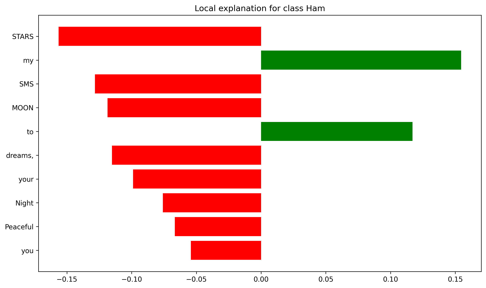

# Multilingual SMS Spam Detection Using XLM-R and BiLSTM

## Overview

This project focuses on detecting **Spam** and **Ham (legitimate)** SMS messages in both **English and Bangla**.

Two deep learning approaches are evaluated:

- **XLM-R (XLM-RoBERTa)** for multilingual text classification
- **BiLSTM** as a comparative baseline

In addition to classification performance, **LIME (Local Interpretable Model-agnostic Explanations)** is used to explain individual predictions and identify the words or tokens that influence the model's decision.

---

## Objectives

- Detect spam SMS messages in English and Bangla.
- Evaluate the performance of XLM-R and BiLSTM.
- Compare Accuracy, Precision, Recall, and F1-score.
- Provide interpretable predictions using LIME.
- Analyze model performance using a confusion matrix.

---

## Models

### XLM-R

XLM-R is used as the primary multilingual classification model. It is particularly suitable for handling text across multiple languages, including both English and Bangla.

### BiLSTM

A Bidirectional Long Short-Term Memory (BiLSTM) model is used as a baseline for performance comparison.

---

## Experimental Results

### Overall Performance

| Model | Accuracy | Precision | Recall | F1-score |
|------|---------:|----------:|-------:|---------:|
| **XLM-R** | **98.14%** | 92.49% | **95.24%** | **93.84%** |
| BiLSTM | 97.60% | **95.48%** | 88.10% | 91.64% |

XLM-R achieves higher **accuracy, recall, and F1-score**, while BiLSTM achieves higher **precision**. :chatgpt-content-reference{index="1"}

### XLM-R by Language

| Language | Samples | Accuracy | Precision | Recall | F1-score |
|---------|--------:|---------:|----------:|-------:|---------:|
| English | 1041 | **98.94%** | 95.42% | 96.15% | 95.79% |
| Bangla | 86 | 88.37% | 83.33% | 92.11% | 87.50% |

The reported results show stronger performance on the English subset, while Bangla classification remains effective but more challenging. :chatgpt-content-reference{index="2"}

---

## Confusion Matrix

The XLM-R confusion matrix contains:

- **946** correctly classified Ham messages
- **160** correctly classified Spam messages
- **13** Ham messages incorrectly classified as Spam
- **8** Spam messages incorrectly classified as Ham

This gives a total of **1,127 evaluated samples**. :chatgpt-content-reference{index="3"}



---

## Model Comparison



The comparison shows that XLM-R provides better overall accuracy, recall, and F1-score, while BiLSTM provides higher precision. :chatgpt-content-reference{index="4"}

---

## Explainability with LIME

LIME is used to provide **local explanations** for individual SMS predictions.

The explanations highlight the words or tokens that contribute positively or negatively to the predicted class.

Examples included in this repository cover:

- Bangla Spam
- English Spam
- English Ham

### Example: Bangla Spam



### Example: English Spam



### Example: English Ham



Interactive word-level LIME explanations are also provided as HTML files.

---

## Repository Structure

```text
ML-Report262/
│
├── project/
│   ├── xlmr_final_model/
│   ├── bilstm_vs_xlmr_comparison.png
│   ├── final_experimental_results.csv
│   ├── lime_bangla_spam.png
│   ├── lime_bangla_spam_word_level.html
│   ├── lime_english_ham.png
│   ├── lime_english_ham_word_level.html
│   ├── lime_english_spam.png
│   ├── lime_english_spam.html
│   └── xlmr_confusion_matrix.png
│
├── 1. sabbir/
├── 2. sadman/
├── 3. boishakhi/
├── 4. shamim/
│
├── .gitattributes
└── .gitignore
